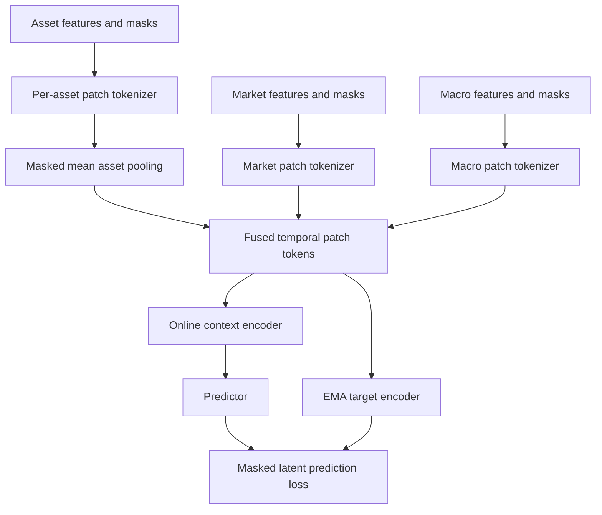

# FI-JEPA

FI-JEPA is a research implementation of a Financial Joint-Embedding Predictive
Architecture. It learns a compact market-state representation from past-only
asset, market, and macro data.

The first goal is not direct return prediction. The model is trained to predict
representations of masked temporal patches from visible historical context,
then evaluated on whether its frozen embeddings capture useful, stable market
structure.

## Motivation

Financial signals are rarely useful in every market state. Trend, volatility,
liquidity, breadth, dispersion, rates, and credit conditions change both the
opportunity set and the behavior of a signal.

FI-JEPA tests a narrower hypothesis:

> Can a self-supervised encoder learn a compact market-state representation
> that improves slow, out-of-sample analysis of future market conditions and
> conditional signal performance?

The implementation deliberately separates representation learning from
tradability:

- The encoder only receives information available at or before the sample date.
- Future targets are stored separately and are never model inputs.
- The JEPA objective predicts latent representations, not raw prices or returns.
- Frozen embeddings are evaluated with walk-forward probes after pretraining.

This is a research prototype, not a trading system.

## Pipeline

The repository keeps three data layers distinct:

1. **Canonical database:** `data/processed/market_data.duckdb`
2. **Frozen model dataset:** immutable sparse Parquet artifacts under
   `data/model_ready/`
3. **Runtime outputs:** checkpoints, evaluations, and probe reports under
   `runs/`

Generated data and run artifacts are intentionally excluded from Git.

## Model

One sample is a 252-trading-day market window ending at date `t`. The dataloader
reconstructs sparse facts into masked tensors and divides time into twelve
21-day patches.



The online encoder sees only visible patches. The exponential-moving-average
target encoder sees the complete valid sequence, and the predictor estimates
the target encoder's representations at masked patch positions.

See [FI_JEPA_MODEL_ARCHITECTURE_PLAN.md](FI_JEPA_MODEL_ARCHITECTURE_PLAN.md) for
the complete tensor and model contract.

## Setup

Requirements:

- Python 3.11 or newer
- [uv](https://docs.astral.sh/uv/getting-started/installation/)
- Enough disk space for the Stooq archives, DuckDB database, and frozen dataset
- A CUDA-capable PyTorch environment is recommended for training

```bash
git clone git@github.com:btatum26/FI-JEPA.git
cd FI-JEPA
uv sync --dev
uv run pytest -q
```

All commands below should be run from the repository root.

## Get The Data

### 1. Stooq daily archives

Download the daily US and world text archives from the
[Stooq historical data page](https://stooq.com/db/h/):

```text
d_us_txt.zip
d_world_txt.zip
```

Preserve them in the repository's raw-data layout:

```bash
uv run import-stooq-archives /path/to/d_us_txt.zip /path/to/d_world_txt.zip
```

The canonical builder expects the preserved files at:

```text
data/raw/stooq/bulk_archives/d_us_txt.zip
data/raw/stooq/bulk_archives/d_world_txt.zip
```

The ZIP files remain compressed. The builder reads their daily text members
directly.

### 2. FRED macro data

Request a key from the
[official FRED API key page](https://fred.stlouisfed.org/docs/api/api_key.html),
then provide it through the environment or an ignored `.env` file:

```text
FRED_API_KEY=your_key_here
```

Download every enabled FRED series from `configs/features.yaml`:

```bash
uv run import-fred-data
```

Raw FRED responses are cached under `data/raw/fred/`.

### 3. Community universes

The repository includes the community-maintained current-constituent and change
CSV files used by the canonical build under `data/community_universes/`.

The current S&P 500 list is backfilled across available history. It is
explicitly marked as survivorship-biased and is not point-in-time membership.

## Build And Train

### Build the canonical DuckDB database

```bash
uv run build-market-database
```

This creates `data/processed/market_data.duckdb`. Its main contracts are:

| Table              | Grain                       | Purpose                               |
| ------------------ | --------------------------- | ------------------------------------- |
| `features`         | One row per date            | Past-only market and macro inputs     |
| `ticker_features`  | One row per date and symbol | Past-only asset inputs                |
| `targets`          | One row per date            | Physically separate future outcomes   |
| `symbol_manifest`  | One row per symbol          | Identity, coverage, and bias metadata |
| `trading_calendar` | One row per observed date   | Full selected-symbol date spine       |

See [data/DATABASE_SCHEMA.md](data/DATABASE_SCHEMA.md) for the full live schema.

### Freeze a model-ready dataset

```bash
uv run build-model-dataset --config configs/model_dataset.yaml
```

The command writes an immutable artifact under:

```text
data/model_ready/fi_jepa_sparse_v1/<timestamp>_<build_id>/
```

After building, set `artifact_path` in `configs/dataloader.yaml` to the new
artifact directory. Training does not automatically select the newest build.

The frozen artifact contains sparse normalized facts, explicit validity masks,
split permissions, normalization statistics, and feature metadata. It does not
store dense windows, asset samples, temporal patches, or JEPA masks; those are
constructed at runtime.

### Train FI-JEPA

```bash
uv run train-fi-jepa --config configs/pretraining.yaml --device auto
```

Runs are written under `runs/pretraining/`. To resume from a run directory or a
specific checkpoint:

```bash
uv run train-fi-jepa --resume runs/pretraining/<run>/checkpoints/latest.pt --device auto
```

The resumed checkpoint's resolved configuration is authoritative.

## Evaluate Representations

Export representation diagnostics and frozen embeddings from a checkpoint:

```bash
uv run evaluate-fi-jepa \
  --checkpoint runs/pretraining/<run>/checkpoints/best_validation.pt \
  --device auto \
  --batch-size 1
```

Evaluation artifacts are written under `runs/evaluation/`. `--batch-size`
overrides the checkpoint's validation batch size for every representation
loader and is useful when all-valid asset views exceed GPU memory.

Export future probe targets from the canonical database:

```bash
uv run export-probe-targets
```

Run leakage-separated walk-forward ridge probes:

```bash
uv run run-fi-jepa-probes \
  --embeddings runs/evaluation/<evaluation_artifact> \
  --targets data/probe_targets/<target_artifact>
```

Embedding and target artifacts remain separate until probe evaluation. See
[docs/probes.md](docs/probes.md) for the artifact and walk-forward probe
contracts.

## Configuration

| File                         | Controls                                                    |
| ---------------------------- | ----------------------------------------------------------- |
| `configs/features.yaml`      | Enabled FRED series and release-lag assumptions             |
| `configs/model_dataset.yaml` | Frozen dataset dates, splits, features, and normalization   |
| `configs/dataloader.yaml`    | Artifact path, windowing, asset sampling, and JEPA masking  |
| `configs/model.yaml`         | Tokenizers, encoders, predictor, and latent dimensions      |
| `configs/pretraining.yaml`   | Optimization, EMA, validation, checkpoints, and run outputs |

## Repository Layout

```text
configs/                 Runtime and dataset configuration
data/
  community_universes/   Versioned source CSVs
  DATABASE_SCHEMA.md     Canonical and frozen artifact contracts
  DATASET_PLAN.md        Source research, current contract, and roadmap
docs/                    Focused builder and probe documentation
src/
  dataset_pipeline/      Canonical database and frozen dataset builders
  fi_jepa/               Dataloader, model, training, evaluation, and probes
tests/                   Pipeline and model contract tests
```

## Research Limitations

- The current stock universe uses current S&P 500 constituents backfilled over
  history, so stock cross-sectional results have high survivorship bias.
- Standard FRED responses contain revised observations, not full ALFRED-style
  point-in-time vintages.
- Masking prevents some leakage paths but does not make a dataset leakage-safe
  by itself. Availability dates, normalization scope, and split boundaries are
  enforced separately.
- A useful-looking latent space is not evidence of tradable value. The model
  should be compared against volatility, hand-built state features, PCA,
  autoencoders, and simple supervised baselines.

## Validation

```bash
uv run pytest -q
uv run ruff check .
```

The tests cover canonical-data leakage checks, split-aware frozen exports,
dataloader masks and duplicate detection, model contracts, checkpoint/resume
behavior, representation evaluation, and frozen probes.
