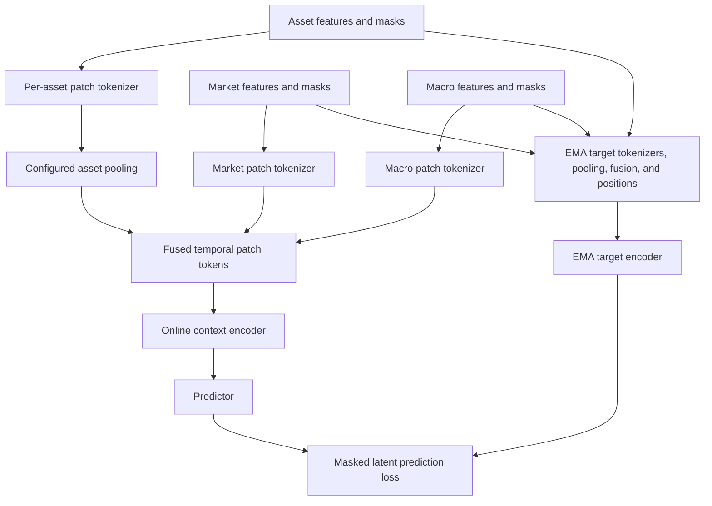

# FI-JEPA

FI-JEPA is a research implementation of a Financial Joint-Embedding Predictive
Architecture. It learns a compact market-state representation from past-only
asset, market, and macro data.

The first goal is not direct return prediction. The model is trained to predict
representations of masked temporal patches from visible historical context,
then evaluated on whether its frozen embeddings capture useful, stable market
structure.

## Motivation

Financial signals are rarely useful in every market state. Trend, volatility,
liquidity, breadth, dispersion, rates, and credit conditions change both the
opportunity set and the behavior of a signal.

FI-JEPA tests a narrower hypothesis:

> Can a self-supervised encoder learn a compact market-state representation
> that improves slow, out-of-sample analysis of future market conditions and
> conditional signal performance?

The implementation deliberately separates representation learning from
tradability:

- The encoder only receives information available at or before the sample date.
- Future targets are stored separately and are never model inputs.
- The JEPA objective predicts latent representations, not raw prices or returns.
- Frozen embeddings are evaluated with walk-forward probes after pretraining.

This is a research prototype, not a trading system.

## Pipeline

The repository keeps three data layers distinct:

1. **Canonical database:** `data/processed/market_data.duckdb`
2. **Frozen model dataset:** immutable sparse Parquet artifacts under
   `data/model_ready/`
3. **Runtime outputs:** checkpoints, evaluations, and probe reports under
   `runs/`

Generated data and run artifacts are intentionally excluded from Git.

## Model

With the current YAML defaults, one sample is a 252-trading-day market window
ending at date `t`. The dataloader reconstructs sparse facts into masked tensors
and divides time into 42 six-day patches. `configs/dataloader.yaml` and
`configs/model.yaml` are authoritative for these values.



The online encoder sees only visible patches. A complete exponential-moving-
average target branch independently tokenizes, pools, fuses, position-embeds,
and encodes the complete valid sequence. The predictor estimates its
representations at masked patch positions.

See [FI_JEPA_MODEL_ARCHITECTURE_PLAN.md](FI_JEPA_MODEL_ARCHITECTURE_PLAN.md) for
the complete tensor and model contract.

## Setup

Requirements:

- Python 3.11 or newer
- [uv](https://docs.astral.sh/uv/getting-started/installation/)
- Enough disk space for the Stooq archives, DuckDB database, and frozen dataset
- A CUDA-capable PyTorch environment is recommended for training

```bash
git clone git@github.com:btatum26/FI-JEPA.git
cd FI-JEPA
uv sync --dev
uv run pytest -q
```

All commands below should be run from the repository root.

## Get The Data

### 1. Stooq daily archives

Download the daily US and world text archives from the
[Stooq historical data page](https://stooq.com/db/h/):

```text
d_us_txt.zip
d_world_txt.zip
```

Preserve them in the repository's raw-data layout:

```bash
uv run import-stooq-archives /path/to/d_us_txt.zip /path/to/d_world_txt.zip
```

The canonical builder expects the preserved files at:

```text
data/raw/stooq/bulk_archives/d_us_txt.zip
data/raw/stooq/bulk_archives/d_world_txt.zip
```

The ZIP files remain compressed. The builder reads their daily text members
directly.

### 2. FRED macro data

Request a key from the
[official FRED API key page](https://fred.stlouisfed.org/docs/api/api_key.html),
then provide it through the environment or an ignored `.env` file:

```text
FRED_API_KEY=your_key_here
```

Download every enabled FRED series from `configs/features.yaml`:

```bash
uv run import-fred-data
```

Raw FRED responses are cached under `data/raw/fred/`.

### 3. Community universes

The repository includes the community-maintained current-constituent and change
CSV files used by the canonical build under `data/community_universes/`.

The current S&P 500 list is backfilled across available history. It is
explicitly marked as survivorship-biased and is not point-in-time membership.

## Build And Train

### Build the canonical DuckDB database

```bash
uv run build-market-database
```

This creates `data/processed/market_data.duckdb`. Its main contracts are:

| Table              | Grain                       | Purpose                               |
| ------------------ | --------------------------- | ------------------------------------- |
| `features`         | One row per date            | Past-only market and macro inputs     |
| `ticker_features`  | One row per date and symbol | Past-only asset inputs                |
| `targets`          | One row per date            | Physically separate future outcomes   |
| `symbol_manifest`  | One row per symbol          | Identity, coverage, and bias metadata |
| `trading_calendar` | One row per observed date   | Full selected-symbol date spine       |

See [data/DATABASE_SCHEMA.md](data/DATABASE_SCHEMA.md) for the full live schema.

### Freeze a model-ready dataset

```bash
uv run build-model-dataset --config configs/model_dataset.yaml
```

The command writes an immutable artifact under:

```text
data/model_ready/fi_jepa_sparse_v1/<timestamp>_<build_id>/
```

After building, set `artifact_path` in `configs/dataloader.yaml` to the new
artifact directory. Training does not automatically select the newest build.

The frozen artifact contains sparse normalized facts, explicit validity masks,
split permissions, normalization statistics, and feature metadata. It does not
store dense windows, asset samples, temporal patches, or JEPA masks; those are
constructed at runtime.

### Train FI-JEPA

```bash
uv run train-fi-jepa --config configs/pretraining.yaml --device auto
```

The `run.name` field in `configs/pretraining.yaml` is the exact run-directory
name. For example, `name: fi_jepa_v1` writes to `runs/pretraining/fi_jepa_v1`.
Later runs with the same name append a readable UTC timestamp, such as
`fi_jepa_v1-2026-06-14-17-23-45`. To resume from a run directory or a specific
checkpoint:

```bash
uv run train-fi-jepa --resume runs/pretraining/<run>/checkpoints/latest.pt --device auto
```

The resumed checkpoint's resolved configuration is authoritative.

To branch a named exact continuation from a checkpoint while turning down the
active learning-rate curve:

```bash
uv run branch-fi-jepa \
  --checkpoint runs/pretraining/<run>/checkpoints/step_000005000.pt \
  --name v2-slower-lr \
  --lr-scale 0.1 \
  --device auto
```

A branch creates a new run directory but otherwise continues the checkpoint
exactly: model, optimizer moments, scaler, RNG, epoch, global step, best
validation loss, and LR/EMA scheduler positions are inherited. `--lr-scale`
multiplies the source branch's complete remaining cosine curve without
restarting warmup or decay. Branch provenance and every supplied override are
stored in `resolved_config.yaml`.

The strict branch override flags are `--lr-scale`, `--weight-decay`,
`--anti-collapse-variance-weight`, `--anti-collapse-covariance-weight`,
`--grad-clip-norm`, `--ema-momentum-start`, `--ema-momentum-end`,
`--validation-every-epochs`, `--representation-evaluation-every-epochs`,
`--checkpoint-every-steps`, `--logging-every-steps`, and `--device`.
Architecture, dataset, dataloader geometry, optimizer type, epoch count, and
scheduler lengths remain checkpoint-authoritative.

### EMA Momentum During Training

The target encoder is updated after each successful optimizer step using:

```text
target = momentum * target + (1 - momentum) * online
```

The active momentum increases linearly from `ema.momentum_start` to
`ema.momentum_end` over the checkpoint's planned optimizer steps:

```text
progress = min(step / (total_steps - 1), 1)
momentum = momentum_start + (momentum_end - momentum_start) * progress
```

A lower momentum gives the online encoder more weight on every update. For
example, momentum `0.99` moves the target 1% toward the online encoder per step,
while `0.999` moves it only 0.1%. Lower values make the teacher respond faster
to current model changes but also make its targets less stable. Higher values
make the teacher smoother and slower to follow the online encoder.
As a rough intuition, the teacher's effective averaging horizon is
`1 / (1 - momentum)`: momentum `0.99` averages on the order of 100 recent
updates, while `0.999` averages on the order of 1,000. The exact influence of
older online states decays exponentially rather than disappearing at that
horizon.

`momentum_start` controls teacher responsiveness earlier in training.
`momentum_end` controls the eventual late-training stability. Increasing from a
lower start to a higher end lets the teacher adapt relatively quickly early,
then become progressively more stable as training converges.

Branch overrides preserve the source scheduler's current step and progress
fraction. Changing `--ema-momentum-start` or `--ema-momentum-end` therefore
changes the active momentum immediately at the same point in training; it does
not restart the EMA schedule. The target encoder weights themselves are also
inherited unchanged. The new bounds only change how strongly future online
encoder updates move those inherited target weights.

For example, step 5,000 of a 55,200-step schedule is about 9.06% through the
EMA curve. Bounds `0.996 -> 0.999` produce an active momentum near `0.996272`.
Branching at that step with EMA start `0.990` and end `0.997` immediately
changes the active momentum to about `0.990634`, then continues increasing
toward `0.997` over the original remaining schedule. That makes the inherited
teacher follow the online encoder substantially faster after the branch.

Every training run records epoch warm-up timings and prints and records boundary timings.
`runs/pretraining/<run>/runtime_summary.txt` separates dataset epoch updates,
dataloader iterator/worker startup, validation, representation evaluation, and
checkpoint writes.

## Evaluate Representations

Export representation diagnostics and frozen embeddings from a checkpoint:

```bash
uv run evaluate-fi-jepa \
  --checkpoint runs/pretraining/<run>/checkpoints/best_validation.pt \
  --device auto \
  --batch-size 1
```

Evaluation artifacts are written under `runs/evaluation/`. `--batch-size`
overrides the checkpoint's validation batch size for every representation
loader and is useful when all-valid asset views exceed GPU memory.

Export future probe targets and past-only baseline features from the canonical
database:

```bash
uv run export-probe-targets
```

Build the reusable leakage-separated probe dataset:

```bash
uv run build-probe-dataset \
  --embeddings runs/evaluation/<evaluation_artifact> \
  --targets data/probe_targets/market_data_targets
```

Run walk-forward probes with transformed targets, inner alpha selection, strong
baseline feature families, linear regression heads, and binary regime
classification heads. The report also includes residualized `z` tests against
hand-built market features and final diagnostic pass/fail gates:

```bash
uv run run-fi-jepa-probes \
  --probe-dataset data/probe_targets/<evaluation_artifact>_probe_dataset
```

Interpret all exported PCA coordinates against selected numeric columns from
the canonical dataset:

```bash
uv run python -m fi_jepa.analysis.analyze_latent_factor \
  --embeddings runs/evaluation/<evaluation_artifact> \
  --features vix_level ticker_features.realized_vol_63d targets.future_realized_vol_63d
```

Embedding and target artifacts remain separate until probe evaluation. See
[docs/probes.md](docs/probes.md) for the artifact and walk-forward probe
contracts.

## Configuration

| File                         | Controls                                                    |
| ---------------------------- | ----------------------------------------------------------- |
| `configs/features.yaml`      | Enabled FRED series and release-lag assumptions             |
| `configs/model_dataset.yaml` | Frozen dataset dates, splits, features, and normalization   |
| `configs/dataloader.yaml`    | Artifact path, windowing, asset sampling, and JEPA masking  |
| `configs/model.yaml`         | Tokenizers, encoders, predictor, and latent dimensions      |
| `configs/pretraining.yaml`   | Optimization, EMA, validation, checkpoints, and run outputs |

## Repository Layout

```text
configs/                 Runtime and dataset configuration
data/
  community_universes/   Versioned source CSVs
  DATABASE_SCHEMA.md     Canonical and frozen artifact contracts
  DATASET_PLAN.md        Source research, current contract, and roadmap
docs/                    Focused builder and probe documentation
src/
  dataset_pipeline/      Canonical database and frozen dataset builders
  fi_jepa/               Dataloader, model, training, evaluation, and probes
tests/                   Pipeline and model contract tests
```

## Research Limitations

- The current stock universe uses current S&P 500 constituents backfilled over
  history, so stock cross-sectional results have high survivorship bias.
- Standard FRED responses contain revised observations, not full ALFRED-style
  point-in-time vintages.
- Masking prevents some leakage paths but does not make a dataset leakage-safe
  by itself. Availability dates, normalization scope, and split boundaries are
  enforced separately.
- A useful-looking latent space is not evidence of tradable value. The model
  should be compared against volatility, hand-built state features, PCA,
  autoencoders, and simple supervised baselines.

## Validation

```bash
uv run pytest -q
uv run ruff check .
```

The tests cover canonical-data leakage checks, split-aware frozen exports,
dataloader masks and duplicate detection, model contracts, checkpoint/resume
behavior, representation evaluation, and frozen probes.
